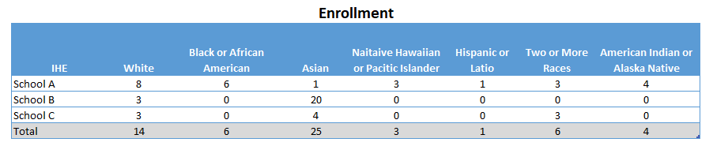
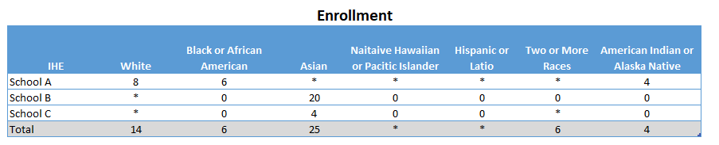
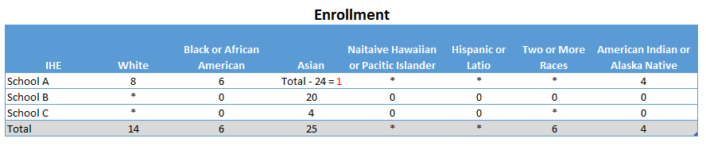
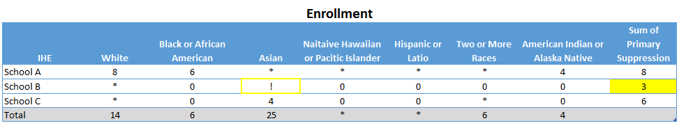

<h1 align="center">Data Suppression</h1>
<h3 align="center">Primary and Complementary Suppression of Title II Educator Preparation Program Enrollment by Race/Ethnicity</h3>

## Background

Privacy suppression techniques are utilized to prevent reidentification and protect individuals' privacy when dealing with cell counts equal to or less than three. In this project we have applied a primary and complementary suppresion. We have applied a minimum N-size of 4 to group size of EPP enrollment as a primary suppression. 

Original data:

Primary suppression minimumn N-size of 4 to group:

Complementary suppression is applied when a group has its data masked because another group doesn’t meet the N-size of 4, and the first group’s results could be determined through simple calculations. 

Therefore, the sum of the primary suppression must be greater then 3, or the next minimum value in a row is suppressed as the complementary suppression.

## Getting Started

This Python script is designed to perform two levels of data suppression on a dataset. The first level of suppression, **primary suppression**, replaces values between 0 and 4 with an asterisk, while the second level, **complementary suppression**, replaces the minimum value in a row with an exclamation mark. To find the minimum value in a row while ignoring both the primary suppressed values and regular zero values, both values are replaced with infitity so they won't interfere with the minimum value calculation. This is where **'np.inf'**, which represents positive infifity, comes into play.

**two_level_suppression function**:
The two_level_suppression function is designed to work with one text column (or one column containing non-numeric data) and perform two levels of data suppression on the remaining numeric columns in the DataFrame. This means that you can have multiple numeric columns alongside the single text column, and the function will apply the suppression only to the numeric columns, leaving the text column untouched. 

- One column, specified as the **text_column**, should contain non-numeric data (e.g., text).
- Other columns can be of type int or float and should contain numeric data that needs suppression.
  
The function will identify and suppress values in the numeric columns, while the text column remains unchanged. 

### Dependencies

This script relies on the following Python packages:

- `pandas`: Data manipulation library for working with data.
- `numpy`: A library for numerical operations.

## Authors

Sydney Leiher,
Data Scientist, 
U.S Department of Education

## Data Sources
U.S Department of Education, Title II Educator Preparation Program Enrollment Data

Notes: Data used in the image examples above is dummy data

## Acknowledgments

https://stackoverflow.com/questions/68275206/how-would-you-suppress-values-below-a-threshold-and-replace-with-a-string-in-pyt 
https://stackoverflow.com/questions/74552418/python-complementary-suppression-of-2nd-lowest-value-row-wise
