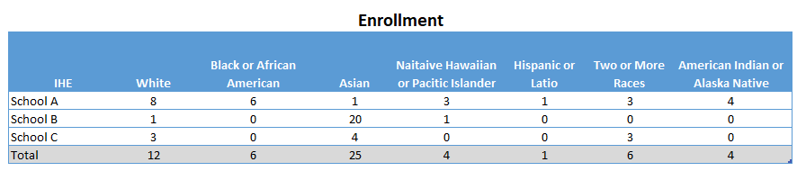

<h1 align="center">Data Suppression</h1>
<h3 align="center">Primary and Complementary Suppression for Title II Educator Preparation Program Enrollment by Race/Ethnicity</h3>

## Background

Privacy suppression techniques are utilized to prevent reidentification and protect individuals' privacy when dealing with cell counts equal to or less than three. In this project we have applied a primary and complementary suppresion. We have applied a minimum N-size of 3 to group size for EPP enrollment as a primary suppression. Complementary suppression is applied when a group has its data masked because another group doesn’t meet the N-size of 3, and the first group’s results could be determined through simple calculations. 

    

## Getting Started

### Dependencies

## Authors

Contributors names and contact info

ex. Dominique Pizzie  
ex. [@DomPizzie](https://twitter.com/dompizzie)

## Version History

* 0.2
    * Various bug fixes and optimizations
    * See [commit change]() or See [release history]()
* 0.1
    * Initial Release

## Acknowledgments

Inspiration, code snippets, etc.
